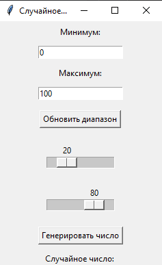

# Генератор Случайных Чисел

Простое графическое приложение на Python, использующее библиотеку tkinter для генерации случайного числа в заданном пользователем диапазоне.

## Описание

Это приложение позволяет пользователю задавать минимальное и максимальное значения для двух слайдеров, которые определяют диапазон. Пользователь может генерировать случайные числа в этом диапазоне с помощью кнопки.

## Функционал

- Ввод минимального и максимального значений для диапазона.
- Два слайдера для выбора диапазона чисел.
- Кнопка для генерации случайного числа в заданном диапазоне.
- Вывод сгенерированного случайного числа.

## Соответствие Требованиям

Приложение разработано в соответствии с требованиями, указанными в [файле](readme_data/Требования.docx).

## Установка

Для работы приложения требуется Python 3.6 или выше. Клонируйте репозиторий или скачайте исходный код

git clone https://github.com/QuirrelForU/RDaA.git


## Запуск приложения

Запустите скрипт main.py с помощью Python:

```python main.py```


## Скриншот приложения




